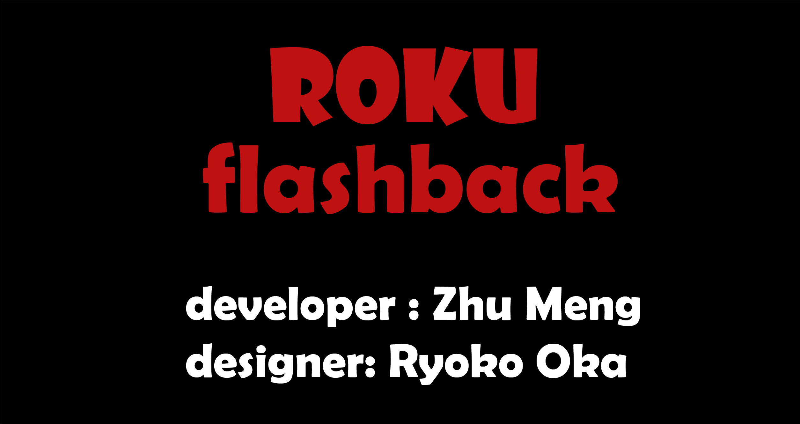

# Roku Server
 
If you miss old movies, don't miss this site. Roku is a website devoted to old movies from the '50s to' 90s. We also offer movies for children, and we tailor the content to the user's age. Roku is also a safe and reliable home theater.
`Still a work in progress`   

## Server Settings
1.  const port = process.env.PORT || 5000;   
2.  Database:  
* user: "root"
* password: "" 
* host: "localhost"
* port:3306
* database: "roku"

## Technologies
* Wampserver
* Visual Studio Code
* Window powershell
* Git Bash

## Prerequisites
* HTML
* CSS
* SASS
* MySQL
* Vue
* Javascript
* Node

## Developer
Zhu Meng
## Designer
Ryoko Oka

## License
 
This project is licensed under the MIT[MIT]
([MIT](https://choosealicense.com/licenses/mit/)) license

Copyright (c) 2021 Meng Zhu

Permission is hereby granted, free of charge, to any person obtaining a copy of this software and associated documentation files (the "Software"), to deal in the Software without restriction, including without limitation the rights to use, copy, modify, merge, publish, distribute, sublicense, and/or sell copies of the Software, and to permit persons to whom the Software is furnished to do so, subject to the following conditions:

The above copyright notice and this permission notice shall be included in all copies or substantial portions of the Software.

THE SOFTWARE IS PROVIDED "AS IS", WITHOUT WARRANTY OF ANY KIND, EXPRESS OR IMPLIED, INCLUDING BUT NOT LIMITED TO THE WARRANTIES OF MERCHANTABILITY, FITNESS FOR A PARTICULAR PURPOSE AND NONINFRINGEMENT. IN NO EVENT SHALL THE AUTHORS OR COPYRIGHT HOLDERS BE LIABLE FOR ANY CLAIM, DAMAGES OR OTHER LIABILITY, WHETHER IN AN ACTION OF CONTRACT, TORT OR OTHERWISE, ARISING FROM, OUT OF OR IN CONNECTION WITH THE SOFTWARE OR THE USE OR OTHER DEALINGS IN THE SOFTWARE.

